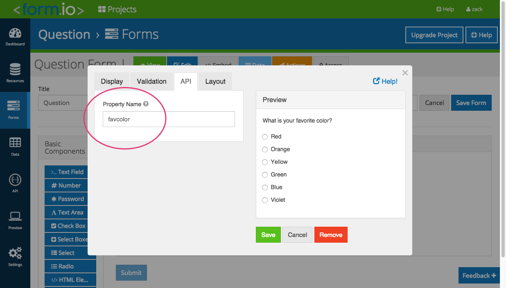

### This repository is now considered legacy and no longer supported. Please take a look at our recent repositories and help documentation at the following links.

 - https://help.form.io
 - https://github.com/formio/formio.js
 - https://github.com/formio/formio
 - https://github.com/formio/react
 - https://github.com/formio/angular
 - https://github.com/formio/vue

Form.io Question
---------------------
An Angular.js directive that provides quiz capabilities to a [Form.io](https://form.io) form using the following simple directive.

```
<formio-question src="'https://project.form.io/form'" question="componentKey"></formio-question>
```

This directive uses the Component Key for rendering a specific portion of a Form as a single aggregate submission.

Options
==================

The following options are available for the directive, to further customize the output:

`src`

    {Required, String} The url for the form being used as a questionnaire.

`question`

    {Required, String} The API key of the form component to be displayed as a question.

`form`

    {Optional, Object} The form containing the current question. If provided, the directive will not query the API, and uses this definition
    as the cached value. Helpful when displaying more than one question.

`submissions`

    {Optional, Array} The submissions for the form containing the question. If provided, the directive will not query the API, and uses the
    given values as the cached answers. Helpful when displaying more than one question from the same form.

`submission`

    {Optional, Object} If provided, the question will use the provided submission object

`wait-for-promise`

    {Optional, Promise} If provided, the directive will wait until the promise resolves, before rendering the question or answer.

`preview-results`

    {Optional, Boolean, default: false} If provided, the results button will be available before a submission has been made.

`update-answer`

    {Optional, Boolean, default: false} If provided, the results page will contain a question button to allow the submission to be changed.

`chart`

    {Optional, String: default: 'table'} If provided, the results will be displayed using the given type.

    Available: table, pie, word cloud

`chartAdvanced`

    {Optional, Object} If provided, nvd3 will use these options for a chart rather than an internal type. Requires `chartDataCustomizer` if provided.
  See [NVD3 Documentation](http://krispo.github.io/angular-nvd3/#/) for more information.

`chartDataCustomizer`

    {Optional, Function} If provided, the results of all submissions will be run through this function before given to the chart defined in
    chartAdvanced. A single parameter data will need to be modified to fix the key:value pairs for the provided chart.

Getting Started
===================
You will first need to create an account at https://form.io. Go there now and sign up for a free account.

Installation
====================
To install this within your application, you will need to use bower.

```
bower install formio-question --save
```

Then, you will need to add the wizard and its dependencies to your HTML page.

To include the Angular dependency, use: `formio-question/dist/question-full.min.js`
To *NOT* include the angular dependeny, use: `formio-question/dist/question-complete.min.js`

```
<link rel="stylesheet" href="https://cdn.rawgit.com/formio/ngFormio/v1.2.1/dist/formio-full.min.css"/>
<script src=""https://cdn.rawgit.com/formio/formio-question/1.0.0/dist/question-full.min.js"></script>
```

Now, you will need to add this to your Angular.js module as a dependency like the following.

```
angular.module('myApp', ['formio.question']);
```

Example
================
Take a look at **index.html** for an example implementation of this quiz capability.

How it works
================
This directive uses form components to render specific questions. Because of this, you will need to create your form
and supply a component API key to the directive for rendering.



IFrame
================
IFrame embedding questions is possible with the following parameters and the given url.

URL: http://formio.github.io/formio-question/iframe.html

`form`

    {Required, String} The url for the form being used as a questionnaire.
     
`question`

    {Required, String} The API key of the form component to be displayed as a question.
    
`preview`

    {Optional, Boolean, default: false} If provided, the results button will be available before a submission has been made.

`update`

    {Optional, Boolean, default: false} If provided, the results page will contain a question button to allow the submission to be changed.
    
`chart`

    {Optional, String: default: table} If provided, the results will be displayed using the given type.
  
    Available: table, pie, word cloud

Example IFrame Embed Code:
```
<iframe src="http://formio.github.io/formio-question/iframe.html??form=https://cuibqcmhuqgqhat.form.io/form/56ba3a5374d7d2010082d5fc&question=thefirstjava1Question&preview=true&update=false&chart=pie" height="500px" width="500px"></iframe>
```

License
================
[MIT](./LICENSE.md)
